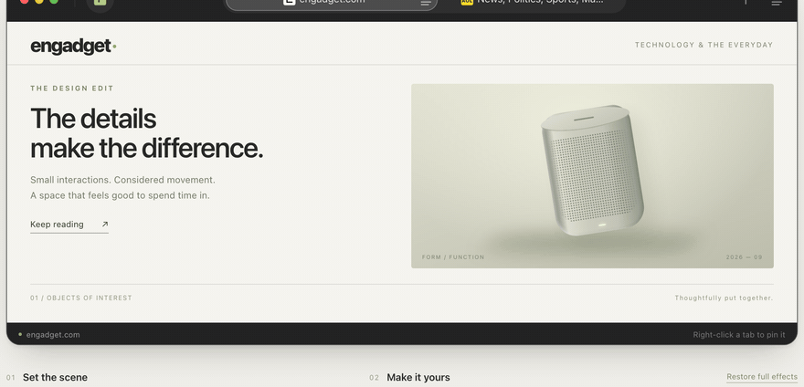

# liquid tabs

A high-performance, cross-platform Safari-style compact glass tab strip for **macOS (SwiftUI/AppKit)** and the **Web (HTML/TypeScript)**.

Based on the refined desktop browser tab architecture with 100% visual and behavioral parity across native Apple platforms and modern browsers.



*Select · **tear-off detach** (pill → page miniature) · **re-attach** spring settle · drag reorder · Escape cancel*

---

## Highlights

* **Safari Glass Design:** 36px compact bar, 18px rounded pills, dynamic backdrop refraction, specular rims, and automatic light/dark theme adaptation.
* **Pinned Tabs:** Inactive pins collapse to compact square icon glyphs; selecting a pin expands its title and address field.
* **Fluid Drag & Reorder:** Physics-based slot swapping with escape band protection and spring-interpolated transitions.
* **Tear-Off Detachment:** Pulling a tab vertically morphs the pill into a scaled page miniature. Releasing outside detaches into an independent window (`NSWindow` on macOS, native popup window on Web).
* **Stationary Hover Popovers:** 650ms debounced metadata cards with zero pointer interference.
* **Zero External Dependencies:**
  * **Swift:** Only Apple system frameworks (`AppKit`, `SwiftUI`, `CoreImage`).
  * **Web:** Pure vanilla TypeScript and standard DOM APIs (no React/Vue runtime overhead).

For the complete architectural analysis, see [**REVIEW.md**](./REVIEW.md).

---

## Directory Structure

```
compact-tab-strip/
├── README.md                      # This guide
├── REVIEW.md                      # In-depth architectural & parity review
├── LICENSE                        # MIT
├── docs/
│   └── compact-tab-strip.gif      # Animated README demo
├── swift/                         # Swift Package Manager (SPM) library
│   ├── Package.swift              # SPM manifest (macOS 13+)
│   ├── Sources/CompactTabStrip/   # Native SwiftUI / AppKit sources
│   │   ├── CompactTabStrip.swift  # Main NSViewRepresentable & NSView
│   │   ├── TabHoverPreview.swift  # Floating NSPanel hover popover
│   │   ├── TabPresentation.swift  # Configuration types & convenience APIs
│   │   ├── TabStripGeometry.swift # Slot layout calculations
│   │   └── TabStripWindowDragGuard.swift
│   └── Examples/
│       └── TabStripDemoView.swift # Drop-in SwiftUI example view
├── web/                           # npm / TypeScript DOM library
│   ├── package.json
│   ├── tsconfig.json
│   ├── vite.config.ts
│   ├── scripts/capture.mjs        # README GIF capture (Playwright + ffmpeg)
│   ├── src/                       # TypeScript module sources
│   │   ├── index.ts               # Package exports
│   │   ├── tab-strip.ts           # Core DOM TabStrip class
│   │   ├── tabs.css               # Glass pill styling & variables
│   │   └── ...
│   └── dist/                      # Generated by `npm run build` (gitignored)
└── standalone/                    # Zero-dependency single-file HTML components
    ├── pie-tab-bar.html           # Inline embeddable component (<style> + <script>)
    ├── pie-tab-bar-preview.html   # Full interactive browser preview with controls
    └── tab-bar-inline.template.html
```

---

## 1. Native SwiftUI / macOS Integration

### 1.1 Adding the Package

In your `Package.swift`:

```swift
dependencies: [
    .package(path: "../compact-tab-strip/swift") // or git URL
],
targets: [
    .target(
        name: "YourApp",
        dependencies: ["CompactTabStrip"]
    )
]
```

Or drag the `swift/` folder directly into your Xcode project.

### 1.2 SwiftUI Usage

```swift
import SwiftUI
import CompactTabStrip

struct ContentView: View {
    @State private var tabs: [CompactTabItem]
    @State private var selection: UUID

    init() {
        let items = [
            CompactTabItem.pinned(title: "Overview", symbol: "house.fill"),
            CompactTabItem.page(title: "Editor", address: "app://editor", symbol: "chevron.left.forwardslash.chevron.right"),
            CompactTabItem.page(title: "Terminal", address: "app://terminal", symbol: "terminal.fill")
        ]
        _tabs = State(initialValue: items)
        _selection = State(initialValue: items[1].id)
    }

    var body: some View {
        CompactTabStrip(
            items: tabs,
            selection: selection,
            onSelect: { selection = $0 },
            onClose: { id in
                if let next = tabs.close(id: id) { selection = next }
            },
            onInsert: {
                let newTab = CompactTabItem.newTab
                tabs.append(newTab)
                selection = newTab.id
            },
            onMove: { id, targetIndex in
                tabs.move(id: id, to: targetIndex)
            },
            onDetach: { id, screenPoint in
                // Open new NSWindow at screenPoint with the detached tab
            },
            onSetPinned: { id, isPinned in
                tabs.setPinned(id, isPinned)
            }
        )
        .frame(height: 36)
    }
}
```

### 1.3 Convenience APIs (Swift)

**Factories** — `CompactTabItem`:

| API | Purpose |
| --- | --- |
| `.page(title:address:symbol:isPinned:)` | Standard page tab |
| `.pinned(title:symbol:address:)` | Pinned launcher tab |
| `.newTab` | Blank “New Tab” ready for input |

**Collection helpers** — `[CompactTabItem]`:

| API | Purpose |
| --- | --- |
| `pinsFirst` | Safari pin-run-first ordering (stable within groups) |
| `setPinned(_:_:)` | Toggle pin and move into the pinned run |
| `move(id:to:)` | Reorder into a visual slot (pins stay grouped) |
| `close(id:)` | Remove a tab and return the suggested next selection |

Keep pins as a leading run in your model — the strip’s geometry matches Safari’s pin-first grouping.

---

## 2. Web / TypeScript Integration

### 2.1 Installation

```bash
cd web
npm install
npm run build
```

### 2.2 Vanilla JavaScript / TypeScript

```typescript
import { TabStrip, fullEffects, letterIcon } from 'compact-tab-strip';
import 'compact-tab-strip/tabs.css';

const container = document.querySelector('#tabs-container')!;

const tabStrip = new TabStrip(container, {
  tabs: [
    { id: 'home', title: 'Home', address: 'app://home', icon: letterIcon('H', '#526941') },
    { id: 'docs', title: 'Docs', address: 'app://docs', icon: letterIcon('D', '#3d5a80') }
  ],
  effects: fullEffects,
  onSelect(tab) {
    console.log('Selected:', tab.id);
  },
  onClose(id) {
    console.log('Closed:', id);
  },
  onMove(id, newIndex) {
    console.log('Moved', id, 'to', newIndex);
  },
  onReload(tab) {
    console.log('Reload:', tab.id);
  },
  onDetach(request) {
    // Custom window.open popup handoff — return true only after the tab is mounted
  }
});

// Programmatic control:
tabStrip.pin('home', true);
tabStrip.setTheme('dark'); // 'dark' | 'light'
tabStrip.move('docs', 0);
tabStrip.selectNext();
```

### 2.3 Convenience APIs (Web)

**Getters**

| API | Returns |
| --- | --- |
| `current` | Copy of the selected tab |
| `items` | Copies of all tabs |
| `size` | Tab count |
| `selectedId` | Selected tab id |
| `isDragging` | Whether a drag is active |
| `theme` | `'dark'` \| `'light'` |
| `configuration` | Copy of active `Effects` |
| `indexOf(id)` / `getTab(id)` | Lookup helpers |

**Mutations & selection**

| API | Purpose |
| --- | --- |
| `setTabs(tabs, selectedId?)` | Replace the model |
| `select(id)` / `selectNext()` / `selectPrevious()` / `selectFirst()` / `selectLast()` | Selection |
| `add(tab?)` / `close(id)` | Insert / remove |
| `pin(id, pinned?)` / `togglePin(id)` | Pin grouping (moves into the pin run) |
| `move(id, index)` | Programmatic reorder (pin-aware) |
| `update(id, partial)` | Patch title / address / icon / hover |
| `detach(id, point?, trigger?)` | Tear-off handoff (returns acceptance) |
| `setTheme` / `setLabelMode` / `setEffects` / `setHoverPreview` | Presentation |
| `destroy()` | Tear down listeners and DOM |

**Presets & helpers** (exported from the package)

| API | Purpose |
| --- | --- |
| `fullEffects` | Full glass + motion |
| `reducedEffects` | Glass kept, reduced motion |
| `noEffects` | Flat / low-power |
| `letterIcon(glyph, background, color?)` | Letter favicon factory |
| `createTabId()` | Collision-resistant id |

**Optional host callbacks**

| Callback | When |
| --- | --- |
| `onSelect(tab)` | Selection changed |
| `onChange(tabs)` | Model changed (copies) |
| `onNavigate(tab, address)` | Address field submitted |
| `onNewTab()` | Provide the next tab model |
| `onReload(tab)` | Reload control activated |
| `onClose(id)` | Tab closed |
| `onMove(id, index)` | Reordered |
| `onPinChange(id, pinned)` | Pin toggled |
| `onDetach(request)` | Tear-off (return `true` only after the destination owns the tab) |

---

## 3. Standalone Single-File Drop-In (HTML)

For fast prototyping or embedding without a build step:

Open [`standalone/pie-tab-bar-preview.html`](./standalone/pie-tab-bar-preview.html) directly in any browser. It contains the full UI, controls, animations, theme toggles, and drag-and-drop tear-off sandbox in a single self-contained file.

---

## 4. Regenerating the README GIF

```bash
cd web
npm install
npx playwright install chromium
npm run build
node scripts/capture.mjs
```

The script serves `web/dist`, drives the hero interactions (select, **tear-off detach**, **re-attach settle**, reorder, Escape cancel), and encodes `docs/compact-tab-strip.gif` with ffmpeg.

---

## Aesthetic Locks

The look is intentionally pinned to macOS Safari’s compact tab strip. Do not change:

* 36px strip height, 18px / 15px pill radii, 36px pin width, 4pt gap
* 120–240pt regular tab width range, 280pt expanded address pill
* Glass tokens (blur, saturation, specular rim, selection fills)
* Spring timings (≈0.25s settle), hover delay (650ms), tear-off thumbnail scale
* SF / system font stack and 13px label size

Behavior, accessibility, convenience APIs, and performance work are welcome — visual tokens are not.

---

## License

[MIT](./LICENSE)
